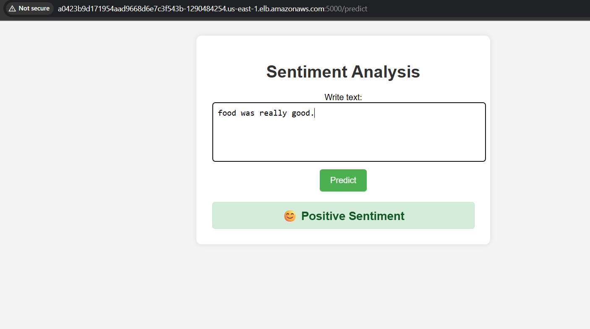
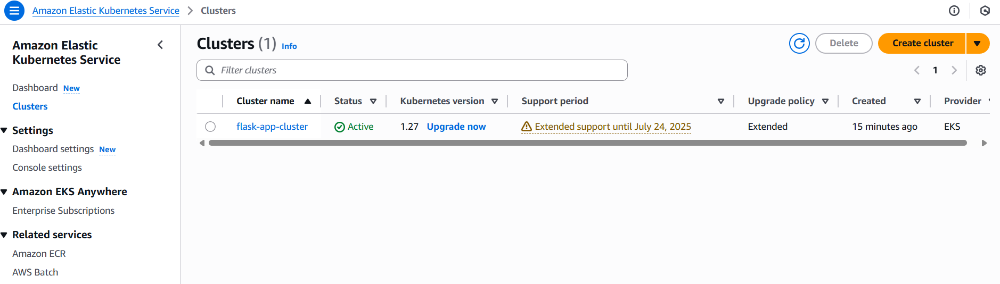
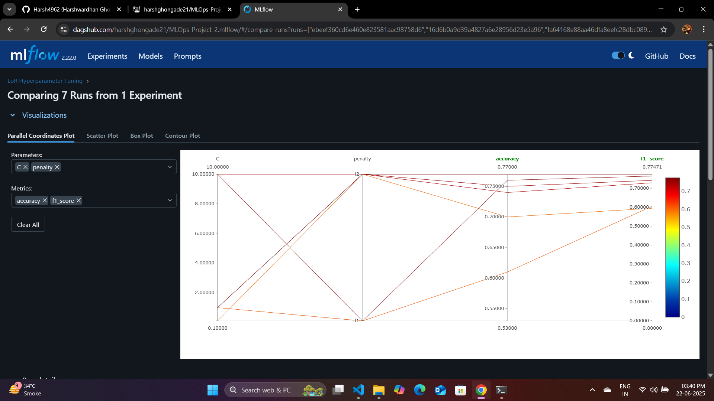
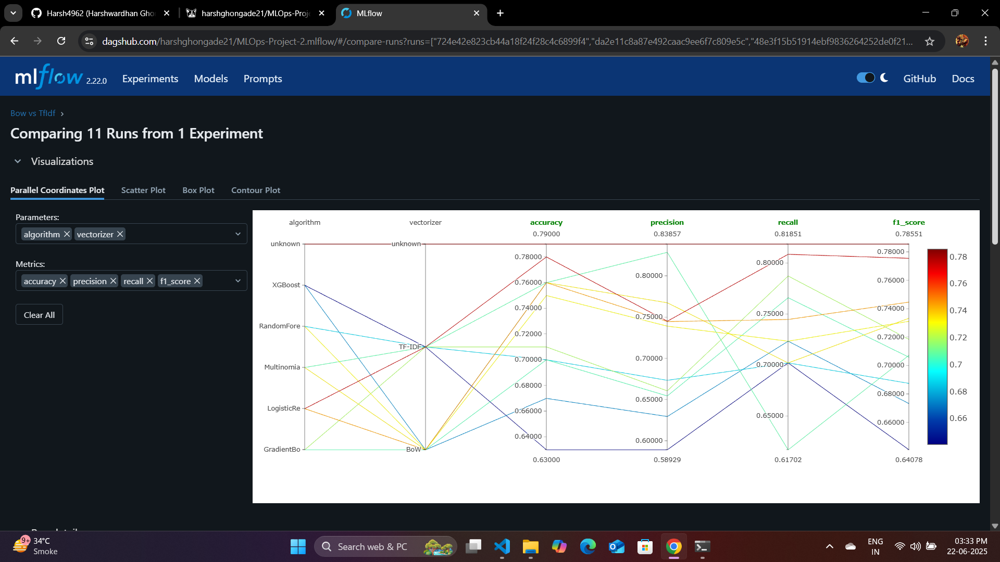
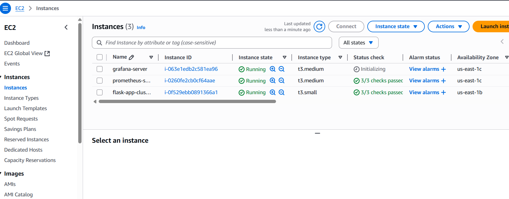
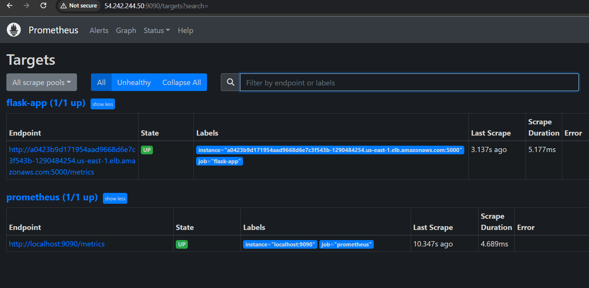

<p align="center">
  
  
  
  
  
  
  
  
  
</p>

# MLOps End-to-End Capstone Project

## 🚀 Project Overview
This project demonstrates an end-to-end MLOps workflow from data ingestion to deployment on AWS EKS, incorporating CI/CD pipelines, experiment tracking with MLflow (via DagsHub), containerization using Docker, and monitoring using Prometheus and Grafana.

**Model Use Case**: Flask app serving a trained ML model.

---

## 🔧 Tech Stack & Tools

| Area                      | Tools Used                                    |
|---------------------------|-----------------------------------------------|
| Experiment Tracking       | MLflow, DagsHub                               |
| Data & Model Versioning   | DVC, AWS S3                                   |
| Model Serving             | Flask                                         |
| Containerization          | Docker                                        |
| Orchestration             | GitHub Actions, CI/CD                         |
| Deployment                | AWS EKS (Kubernetes)                          |
| Monitoring                | Prometheus + Grafana on EC2                   |

---

## 📁 Project Structure (Cookiecutter Template)
```

├── .github/workflows        # CI/CD Pipeline
├── dvc.yaml                 # DVC pipeline definition
├── params.yaml              # Parameters for reproducibility
├── flask\_app                # Flask application code
├── src                      # Core ML pipeline code
│   ├── data\_ingestion.py
│   ├── data\_preprocessing.py
│   ├── feature\_engineering.py
│   ├── model\_building.py
│   ├── model\_evaluation.py
│   ├── register\_model.py
│   └── logger.py
├── tests                   # Unit & integration tests
├── Dockerfile              # Image definition
├── requirements.txt        # Python dependencies
└── scripts                 # Utility scripts

````

---

## 📌 Key Features

### 1. **MLFlow Tracking on DagsHub**
- All experiments tracked.
- Parameters, metrics, and models logged.
- Visual dashboards on DagsHub.

### 2. **Data Versioning with DVC + S3**
- Tracked intermediate files and final model.
- Enabled full reproducibility.

### 3. **CI/CD with GitHub Actions**
- Build, test, and push Docker images.
- Auto-deploy to EKS after code changes.

### 4. **Dockerized Flask App**
- REST API for model inference.
- Built with production-ready best practices.

### 5. **EKS Cluster with eksctl**
- Fully managed Kubernetes deployment.
- Secure and scalable.
- Ingress configured with LoadBalancer Service.

### 6. **Monitoring with Prometheus & Grafana**
- Real-time metrics on app performance.
- Dashboards for uptime and latency.

---

## 🛠️ Setup Instructions

### Environment Setup
```bash
conda create -n atlas python=3.10
conda activate atlas
pip install -r requirements.txt
````

### DVC & S3 Setup

```bash
dvc init
dvc remote add -d myremote s3://<bucket-name>
aws configure
```

### MLflow on DagsHub

```bash
pip install mlflow dagshub
export MLFLOW_TRACKING_URI=<dagshub-url>
export DAGS_HUB_TOKEN=<your-token>
```

---

## 🐳 Docker & CI/CD

### Docker Build & Run

```bash
docker build -t capstone-app:latest .
docker run -p 8888:5000 -e CAPSTONE_TEST=<dagshub-token> capstone-app:latest
```

### GitHub Actions Secrets Required

```
AWS_ACCESS_KEY_ID
AWS_SECRET_ACCESS_KEY
AWS_REGION
CAPSTONE_TEST
ECR_REPOSITORY
AWS_ACCOUNT_ID
```

---

## ☁️ Deployment: AWS EKS

### EKS Cluster Setup

```bash
eksctl create cluster \
  --name flask-app-cluster \
  --region us-east-1 \
  --version 1.27 \
  --nodegroup-name flask-app-nodes \
  --node-type t3.small \
  --nodes 1 --nodes-min 1 --nodes-max 1 --managed
```

### Kubernetes Deployment

```bash
kubectl get nodes
kubectl apply -f deployment.yaml
kubectl get svc
```

### Access App

```
http://<external-loadbalancer-ip>:5000
```

---

## 📊 Monitoring Setup

### Prometheus (on EC2)

* Accessible at: `http://<ec2-ip>:9090`
* Configured to scrape your Flask app's metrics.

### Grafana (on EC2)

* Accessible at: `http://<ec2-ip>:3000`
* Prometheus added as data source.
* Dashboards show live app performance.

---

## 🧹 AWS Cleanup Checklist

* [x] Delete Kubernetes deployment & service
* [x] Terminate EKS Cluster
* [x] Delete EC2 Prometheus & Grafana servers
* [x] Delete unused S3 buckets
* [x] Delete ECR images

---

## 📸 Screenshots (Proof of Deployment)

> All below screenshots are proofs of successful deployment and monitoring steps.

### 🔹 App served via EKS Cluster  


---

### 🔹 EKS Cluster Console  


---

### 🔹 MLflow Experiments (Tracked Parameters)  


---

### 🔹 MLflow Experiments (Vec vs Algo)  


---

### 🔹 Grafana on EC2  


---

### 🔹 Kubernetes Node, Prometheus & Grafana EC2 instances 


---

### 🔹 Prometheus on EC2  


---

## 🏆 Achievements

* ✅ Fully automated ML pipeline with DVC
* ✅ CI/CD with GitHub Actions
* ✅ Scalable Kubernetes deployment with EKS
* ✅ End-to-end observability with Prometheus and Grafana

---

## ✍️ Author

**Harshwardhan Ghongade**

> 2nd Year B.Tech Mechanical Engineering @ IIT Kanpur | Passionate about MLOps & Cloud | Built completely from scratch 🚀

---

**If you like this project, leave a ⭐ and connect with me!**

